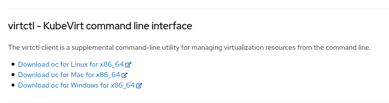

# Provide virtctl binary inside cluster for disconnected use-case

This repo shows how to provide `virtctl` to users with ConsoleCliDownloads objects and a simple httpd server.

## Build & Deploy

- Download example artifacts from Github before packaging
```
bash 1-download-artifacts.sh
```

- Build and push the container image for demo
```
export IMAGE=<full-image-reference>
bash 2-build-container-image.sh
```

> `quay.io/erkanerol/httpd-virtctl` is available and public. You can use it without building.


- Deploy the demo source
```
export IMAGE=<full-image-reference>
bash 3-deploy-demo.sh
```

## Demo

Open the OpenShift web ui. Click `?` button in the right-top menu. Go to `Command line tools`.

You will observe this section and you will be able download `virtctl` by clicking the links.


